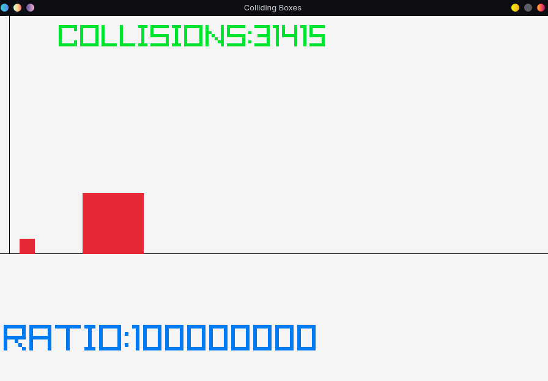

### Colliding Box Computing PI
This is a simple demonstration of an interesting outcome during collision of two boxes which have mass in certain ratio to one
another. An indepth explanation and a better simulator is shown in 3blue1brown's youtube video where I first learn about this.
[Link to the Video](https://www.youtube.com/watch?v=6dTyOl1fmDo&pp=ygUYY29sbGlkaW5nIGJveCBjb21wdXRlIHBp)

---

### My Take on this
This a Raylib version of this and I achieved 5 digits (3.14159) by running the simulation for almost a minute and I am not sure if 
this program can achieve more than this because there are a lot of optimzations that I have not done because I didn't have time to do
Also, the code ended up being bad at the end because  I was trying to make the box appear nice since it was hitting and passing throug the wall.

A screenshot from the program is attached below.

